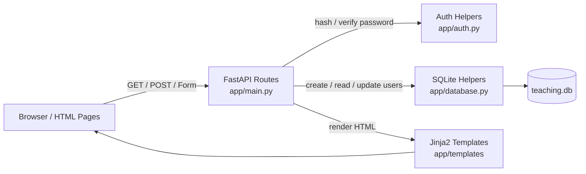
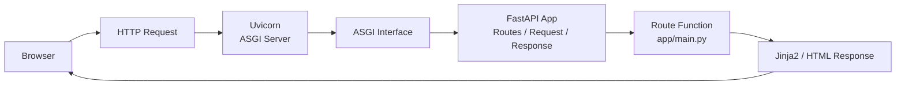
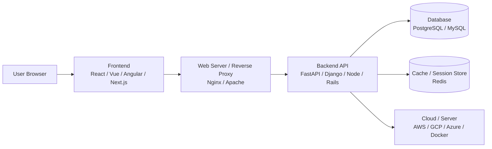

# FastAPI Teaching Site

這是一個給初學者使用的 Python / FastAPI 後端教學 demo。它不是產品型網站，而是一個可以邊操作、邊理解概念的教學網站：每個主要頁面都包含「概念說明、實際操作、執行結果、發生了什麼」四個部分。

本專案重點是讓學習者看懂瀏覽器、後端路由、HTTP GET/POST、HTML form、SQLite 資料庫、帳號註冊、登入狀態、修改密碼、登入後新增使用者之間如何串起來。

## 教學目標

完成這個 demo 後，學習者應該能理解：

1. FastAPI 路由如何代表後端功能。
2. GET 與 POST 都能傳變數，但資料位置與使用情境不同。
3. URL query string 與 path parameter 如何把資料交給後端。
4. HTML form 如何透過 POST request body 傳送資料。
5. 前端頁面、後端 route function、SQLite 資料庫如何互相配合。
6. 使用者資料表如何建立、寫入、查詢與更新。
7. 為什麼密碼不應該明文儲存。
8. 登入狀態可以如何被瀏覽器 cookie 維持。
9. 登入後修改密碼與登入後新增使用者的基本流程。
10. 真實商用網站中，前端、後端、資料庫、伺服器通常如何搭配。

## 專案架構

這個 demo 採用刻意簡化的 server-rendered architecture：

- 瀏覽器直接向 FastAPI 發送 HTTP request。
- FastAPI route function 接收 GET/POST/form/path/query 資料。
- 需要資料庫時，後端透過 Python 標準庫 `sqlite3` 操作 SQLite。
- 後端用 Jinja2 template 回傳 HTML。
- 登入狀態用教學用 cookie `teaching_user` 示範。



## 檔案結構

```text
app/
  __init__.py
  main.py                 FastAPI app 與所有 route functions
  database.py             SQLite 初始化、建立使用者、查詢使用者、更新密碼
  auth.py                 密碼雜湊、密碼驗證、教學 cookie helper
  static/
    styles.css            簡單 CSS
  templates/
    base.html             共用 layout 與導覽列
    index.html            首頁與後端概念
    methods.html          GET vs POST 操作頁
    methods_get_result.html
    methods_post_result.html
    search.html           query parameter 範例
    form.html             HTML form 操作頁
    form_result.html
    database.html         SQLite 概念頁
    user_detail.html      path parameter + database lookup
    register.html         註冊頁
    login.html            登入頁
    protected.html        需要登入的頁面
    change_password.html  登入後修改密碼
    add_user.html         登入後新增使用者
    commercial_stack.html 商用架構簡介
    summary.html          課程小結

tests/
  conftest.py             測試用暫存 SQLite database
  test_skeleton.py
  test_teaching_routes.py
  test_users.py
  test_auth.py

pyproject.toml            專案套件與 pytest 設定
uv.lock                   uv lockfile
.python-version           Python 版本
plan.md                   教學與 README 重點
```

## 使用的 Python 套件與功能

### Runtime packages

| 套件 | 用途 |
|---|---|
| `fastapi` | 建立後端 app、定義 route、讀取 request、處理 `Form(...)` |
| `uvicorn[standard]` | ASGI 開發伺服器，用來啟動 FastAPI |
| `jinja2` | HTML template engine，讓後端回傳動態 HTML |
| `python-multipart` | 讓 FastAPI 可以解析瀏覽器送出的 form body |

### FastAPI 與 Uvicorn 的階層與分工

FastAPI 和 Uvicorn 常常一起出現，但它們不是同一層東西。



分工可以這樣理解：

| 層級 | 負責工具 | 做什麼 |
|---|---|---|
| 網路伺服器層 | `uvicorn` | 監聽 port，例如 `127.0.0.1:8000`，接收瀏覽器送來的 HTTP request |
| Python web 標準介面 | ASGI | 定義 server 和 Python web app 之間如何溝通 |
| Web framework 層 | `fastapi` | 定義 routes、解析 request、驗證參數、呼叫對應的 Python function、產生 response |
| 應用程式邏輯層 | `app/main.py` | 實際處理 `/form`、`/login`、`/database` 等功能 |
| HTML 呈現層 | `jinja2` | 把後端資料放進 template，產生 HTML 回給瀏覽器 |

也就是說，啟動指令：

```bash
uv run uvicorn app.main:app --reload
```

意思是：

- `uv run`：在專案虛擬環境中執行指令。
- `uvicorn`：啟動 ASGI server。
- `app.main:app`：載入 `app/main.py` 裡名為 `app` 的 FastAPI 物件。
- `--reload`：開發模式，程式碼修改後自動重啟 server。

簡化比喻：

- `uvicorn` 像餐廳門口接待與傳菜的人，負責把客人的 request 接進來、把 response 送出去。
- `FastAPI` 像餐廳內部的點餐系統，根據路由決定要交給哪個處理函數。
- `app/main.py` 裡的 route function 才是真正準備內容的人。

### Development / test packages

| 套件 | 用途 |
|---|---|
| `pytest` | 自動化測試 |
| `httpx` | FastAPI / Starlette `TestClient` 需要的 HTTP client transport |

### Python 標準庫

| 模組 | 用途 |
|---|---|
| `sqlite3` | 操作 SQLite database，不使用 ORM，讓 SQL 更容易看懂 |
| `hashlib` | 使用 PBKDF2-HMAC-SHA256 產生密碼 hash |
| `secrets` | 產生 salt，並用 `compare_digest` 做安全比較 |
| `datetime` | 記錄使用者建立時間 |
| `pathlib` / `os` | 路徑與環境變數處理 |

## 安裝與執行

### 1. 安裝 uv

macOS 可用：

```bash
brew install uv
```

或使用官方安裝方式：

```bash
curl -LsSf https://astral.sh/uv/install.sh | sh
```

### 2. 從 GitHub 下載專案

```bash
git clone <your-repo-url>
cd Demo_Site_python
```

如果你是直接拿到本機資料夾，進入專案根目錄即可。

### 3. 建立虛擬環境並安裝套件

```bash
uv sync --dev
```

這會依照 `pyproject.toml` 與 `uv.lock` 建立 `.venv`，並安裝 runtime 與 test dependencies。

### 4. 啟動網站

```bash
uv run uvicorn app.main:app --reload
```

開啟瀏覽器：

```text
http://127.0.0.1:8000
```

### 5. 執行測試

```bash
uv run pytest
```

## 主要網頁與功能說明

| Route | 頁面 | 教學重點 |
|---|---|---|
| `GET /` | 首頁 | 後端是什麼、整體導覽 |
| `GET /methods` | GET vs POST | 比較 URL 傳值與 body 傳值 |
| `GET /methods/get-demo?message=...` | GET 結果頁 | query parameter 會出現在 URL |
| `POST /methods/post-demo` | POST 結果頁 | form body 不會出現在 URL |
| `GET /search?q=...` | Search demo | GET query string |
| `GET /form` | Form demo | HTML form 結構 |
| `POST /form` | Form result | FastAPI `Form(...)` 讀取 POST body |
| `GET /database` | Database demo | SQLite table 與 SQL 查詢概念 |
| `GET /users/{user_id}` | User lookup | path parameter + database SELECT |
| `GET /register` | Register form | 註冊流程說明 |
| `POST /register` | Register submit | 建立使用者、hash 密碼、INSERT |
| `GET /login` | Login form | 登入流程說明 |
| `POST /login` | Login submit | 查詢使用者、驗證密碼、設定 cookie |
| `GET /protected` | Protected page | 需要登入 cookie 才能進入 |
| `POST /logout` | Logout | 清除 cookie |
| `GET /change-password` | Change password form | 登入後才能修改密碼 |
| `POST /change-password` | Change password submit | 驗證舊密碼、更新新密碼 hash |
| `GET /add-user` | Add user form | 登入後新增使用者 |
| `POST /add-user` | Add user submit | 建立另一個帳號 |
| `GET /commercial-stack` | Commercial stack | 商用前後端、資料庫、伺服器搭配 |
| `GET /summary` | Summary | 小結完整流程 |

## 各功能原理

### GET 變數傳遞

GET 通常用於讀取資料。變數會放在 URL 裡，例如：

```text
/search?q=fastapi
/methods/get-demo?message=hello
```

FastAPI 可以用 function parameter 接收：

```python
@app.get("/search")
async def search(request: Request, q: str = ""):
    ...
```

特點：

- 變數看得到。
- 可以複製、分享、書籤保存。
- 適合搜尋、篩選、查詢。
- 不適合放密碼或敏感資料。

### POST 變數傳遞

POST 通常用於送出表單、建立資料或修改資料。變數在 request body，不會直接顯示在 URL。

```html
<form method="post" action="/form">
  <input name="name">
  <input name="message">
</form>
```

FastAPI 用 `Form(...)` 接收：

```python
@app.post("/form")
async def form_submit(name: str = Form(""), message: str = Form("")):
    ...
```

特點：

- URL 不會顯示提交值。
- 適合註冊、登入、新增資料、修改資料。
- 仍然需要 HTTPS 才能保護傳輸內容。

### Path parameter

Path parameter 是 URL 路徑的一部分：

```text
/users/1
```

FastAPI route：

```python
@app.get("/users/{user_id}")
async def user_detail(user_id: int):
    ...
```

這個 demo 用它示範「從 URL 取得 id，再去資料庫查使用者」。

### Form

表單是瀏覽器內建的資料送出機制。這個 demo 的 form 頁面讓你實際看到：

1. HTML `<form>` 收集 input。
2. browser 送出 GET 或 POST request。
3. FastAPI route function 接收欄位。
4. template 把收到的資料顯示回頁面。

### Database

這個專案使用 SQLite，資料存在專案根目錄的 `teaching.db`。

`users` table：

```sql
CREATE TABLE IF NOT EXISTS users (
    id            INTEGER PRIMARY KEY AUTOINCREMENT,
    username      TEXT NOT NULL UNIQUE,
    password_hash TEXT NOT NULL,
    created_at    TEXT NOT NULL
);
```

資料庫操作集中在 `app/database.py`：

- `init_db()`：建立 `users` table
- `create_user()`：新增使用者
- `get_user_by_username()`：用 username 查詢使用者
- `get_user_by_id()`：用 id 查詢使用者
- `update_password()`：更新使用者密碼 hash

本專案使用 parameterized query：

```python
conn.execute("SELECT * FROM users WHERE id = ?", (user_id,))
```

不要用字串拼接 SQL：

```python
# 不建議
f"SELECT * FROM users WHERE id = {user_id}"
```

## 帳號與密碼流程

### 註冊

流程：

1. 使用者送出 `POST /register`。
2. 後端檢查 username 是否存在。
3. 後端產生 salt。
4. 使用 PBKDF2-HMAC-SHA256 產生 password hash。
5. 只把 `salt$hash_hex` 存入 SQLite。
6. 重新導向 `/login?registered=1`。

### 登入

流程：

1. 使用者送出 `POST /login`。
2. 後端用 username 查資料庫。
3. 後端用輸入密碼重新計算 hash。
4. 用 `secrets.compare_digest()` 比對。
5. 成功後設定 HTTP-only cookie：`teaching_user=<username>`。
6. 導向 `/protected`。

### 需要登入的頁面

`/protected`、`/change-password`、`/add-user` 都會先檢查 cookie。

這是教學簡化版：

```python
request.cookies.get("teaching_user")
```

如果沒有 cookie，就導向 `/login`。

### 修改密碼

流程：

1. 使用者必須已登入。
2. 使用者輸入目前密碼與新密碼。
3. 後端先驗證目前密碼是否正確。
4. 正確才產生新 hash 並更新資料庫。
5. 目前密碼錯誤時，不更新資料庫。

### 登入後新增使用者

流程：

1. 使用者必須已登入。
2. 使用者輸入新 username 與 password。
3. 後端檢查 username 是否重複。
4. 後端 hash 密碼。
5. 新增另一筆使用者資料。

這個頁面用來示範「某些後端操作需要登入狀態」。

## 商用架構對照

這個 demo 故意簡化，但真實商用網站通常會拆成更多元件：



常見搭配：

| 層級 | Demo 使用 | 商用常見選項 |
|---|---|---|
| Frontend | Jinja2 HTML | React, Vue, Angular, Next.js |
| Backend | FastAPI | FastAPI, Django, Node/Express, Rails, Spring Boot |
| Database | SQLite | PostgreSQL, MySQL, MariaDB, MongoDB |
| Session / Cache | Teaching cookie | Server-side session, Redis session, signed cookie, JWT |
| Server | Uvicorn dev server | Nginx, Docker, Kubernetes, AWS/GCP/Azure |

## Features / Issues / 延伸安全議題

### 1. SQL injection 防範

本專案使用 `?` placeholders：

```python
conn.execute("SELECT * FROM users WHERE username = ?", (username,))
```

這可以避免使用者輸入被當作 SQL 指令執行。

這行程式可以拆成兩個部分看：

```python
"SELECT * FROM users WHERE username = ?"
```

這是 SQL 模板。`?` 是 placeholder，代表「這裡之後會放一個值」。

```python
(username,)
```

這是傳給 SQLite driver 的參數 tuple。注意後面有逗號，`(username,)` 才是一個只有一個元素的 tuple；`(username)` 只是括號包住變數，不是 tuple。

這裡容易誤解，因為 Python 的 tuple 不是靠括號決定，而是靠逗號決定。

```python
username = "alice"

type((username,))
# <class 'tuple'>

type((username))
# <class 'str'>
```

所以：

```python
(username,)
```

代表「一個包含 `username` 的 tuple」。

但：

```python
(username)
```

只等於：

```python
username
```

SQLite 的 `execute()` 第二個參數需要一組參數值，也就是 sequence。即使只有一個值，也要寫成 `(username,)`，讓 SQLite driver 知道「這是一組參數，其中第一個值要放到第一個 `?`」。

例如你要查詢的 username 是 `alice`：

```python
username = "alice"

conn.execute(
    "SELECT * FROM users WHERE username = ?",
    (username,),
)
```

實際傳遞可以理解成：

```text
SQL 模板: SELECT * FROM users WHERE username = ?
參數 tuple: ("alice",)
```

也就是：

```text
第 1 個 ?  ←  "alice"
```

但要注意，SQL 不會變成這樣：

```sql
SELECT * FROM users WHERE username = ('alice',)
```

SQLite 也不是收到一段含有 tuple 的 SQL 字串。真正發生的是：SQLite driver 收到 SQL 模板和參數值，然後把第一個 `?` 安全地綁定成字串 `"alice"`。

概念上，它等價於查詢：

```sql
SELECT * FROM users WHERE username = 'alice'
```

但實作上不是用字串拼接產生這段 SQL，而是用參數綁定，所以比較安全。

完整流程是：

1. Python 把 SQL 模板交給 SQLite：`SELECT * FROM users WHERE username = ?`
2. Python 另外把參數交給 SQLite：`(username,)`
3. SQLite driver 知道 `username` 是「資料值」，不是 SQL 指令。
4. 即使使用者輸入奇怪內容，例如 `alice' OR '1'='1`，SQLite 也會把它當成普通 username 字串查詢，而不是把它當成 SQL 條件執行。

錯誤示範：

```python
sql = f"SELECT * FROM users WHERE username = '{username}'"
conn.execute(sql)
```

如果使用者輸入：

```text
alice' OR '1'='1
```

最後 SQL 可能變成：

```sql
SELECT * FROM users WHERE username = 'alice' OR '1'='1'
```

`'1'='1'` 永遠成立，這就是典型 SQL injection 的概念。

正確寫法：

```python
conn.execute(
    "SELECT * FROM users WHERE username = ?",
    (username,),
)
```

這不是單純的字串取代。SQLite driver 會用資料庫自己的參數綁定機制處理型別、跳脫與查詢計畫，因此使用者輸入不會變成 SQL 語法的一部分。

多個欄位時，每個 `?` 對應一個參數：

```python
conn.execute(
    "INSERT INTO users (username, password_hash, created_at) VALUES (?, ?, ?)",
    (username, password_hash, created_at),
)
```

對應關係是：

| SQL placeholder | Python 參數 |
|---|---|
| 第 1 個 `?` | `username` |
| 第 2 個 `?` | `password_hash` |
| 第 3 個 `?` | `created_at` |

在這個專案裡，查詢、新增、更新都使用同一種方式：

```python
conn.execute("SELECT * FROM users WHERE id = ?", (user_id,))
conn.execute("SELECT * FROM users WHERE username = ?", (username,))
conn.execute("UPDATE users SET password_hash = ? WHERE username = ?", (new_hash, username))
```

教學重點：

- 不要把使用者輸入直接拼進 SQL 字串。
- 使用 parameterized query。
- ORM 也通常會幫你處理參數化，但本 demo 使用 `sqlite3` 讓概念更直接。

### 2. SSL / TLS

這個 demo 在本機用 HTTP：

```text
http://127.0.0.1:8000
```

商用網站應使用 HTTPS，否則登入密碼、cookie、表單內容可能在網路傳輸中被攔截。

正式部署常見做法：

- 使用 Nginx / Caddy / cloud load balancer 終止 TLS。
- 使用 Let's Encrypt 或雲端憑證管理。
- Cookie 設定 `Secure` 與 `SameSite`。

### 3. 密碼方法與安全性

本 demo 不儲存明文密碼，而是儲存：

```text
salt$hash_hex
```

使用：

- `secrets.token_hex(16)` 產生 salt
- `hashlib.pbkdf2_hmac(...)` 產生 hash
- `secrets.compare_digest(...)` 比對 hash

商用系統可考慮：

- Argon2
- bcrypt
- passlib / pwdlib
- 密碼強度政策
- 密碼重設流程
- 登入嘗試次數限制

### 4. 登入狀態維護：Session / Cookie / JWT

本 demo 使用非常簡化的 teaching cookie：

```text
teaching_user=<username>
```

這容易理解，但不適合正式環境，因為使用者可能偽造 cookie。

常見做法比較：

| 概念 | 傳統 ASP | 現代常見做法 |
|---|---|---|
| 使用者登入狀態 | `Session` | signed cookie session, server-side session, Redis session, JWT |
| 全域應用狀態 | `Application` | app state, config object, dependency injection singleton, cache, Redis, database |
| `Application("x")` | 全域變數式存取 | `app.state.x`, singleton service, config object, cache client |

教學上可先理解 cookie，再進一步學 signed session 或 JWT。

### 5. 其他可延伸主題

之後可以再補：

- CSRF 防護
- 表單 validation
- 使用者角色與權限
- 資料庫 migration
- Docker 部署
- PostgreSQL 取代 SQLite
- Nginx reverse proxy
- API JSON response 與 Swagger docs
- 前端框架串接 FastAPI API

## 已知限制

這個專案是教學 demo，不是 production-ready app：

- Cookie 內直接存 username，未簽章、未加密。
- 沒有 CSRF protection。
- 沒有密碼強度檢查。
- 沒有登入失敗次數限制。
- 沒有真正的角色權限控管。
- SQLite 適合本機與教學，不適合高併發商用服務。
- Uvicorn `--reload` 是開發模式，不是正式部署模式。

## 測試

目前測試涵蓋：

- 首頁 HTML 回應
- GET/POST 比較頁
- query parameter
- form POST
- database 初始化與查詢
- 註冊與密碼 hash
- 登入成功/失敗
- protected page redirect
- logout
- 修改密碼
- 登入後新增使用者
- summary page

執行：

```bash
uv run pytest
```

## 建議教學順序

1. 先開 `/` 說明什麼是後端。
2. 到 `/methods` 操作 GET 與 POST，比較 URL 是否出現變數。
3. 到 `/form` 操作一般 HTML form。
4. 到 `/database` 說明 SQLite 與 SQL。
5. 到 `/register` 建立第一個使用者。
6. 到 `/login` 登入。
7. 到 `/protected` 看 cookie-based login state。
8. 到 `/change-password` 修改密碼。
9. 到 `/add-user` 登入後新增另一個使用者。
10. 到 `/commercial-stack` 看商用架構對照。
11. 到 `/summary` 做小結。
